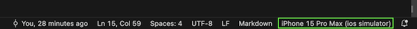

# todoapp

## Pre-reqs

In order to run/execute a Dart/Flutter app, there a few pre-requisites that need to be fulfilled:

* Xcode
* VS Code
* Flutter plugin (VS Code)
    * Once you have Flutter installed, you could run `flutter doctor` to see a checklist of things you might be mising. You could ignore the Android tools, if they 
        show up as unchecked

## Running the app

The main app resides in the `/lib` folder and running the `main.dart` file opens the app in desktop mode.
If you would like to change it, you can do so by clicking the lower-right section of VS Code as shown in following image

